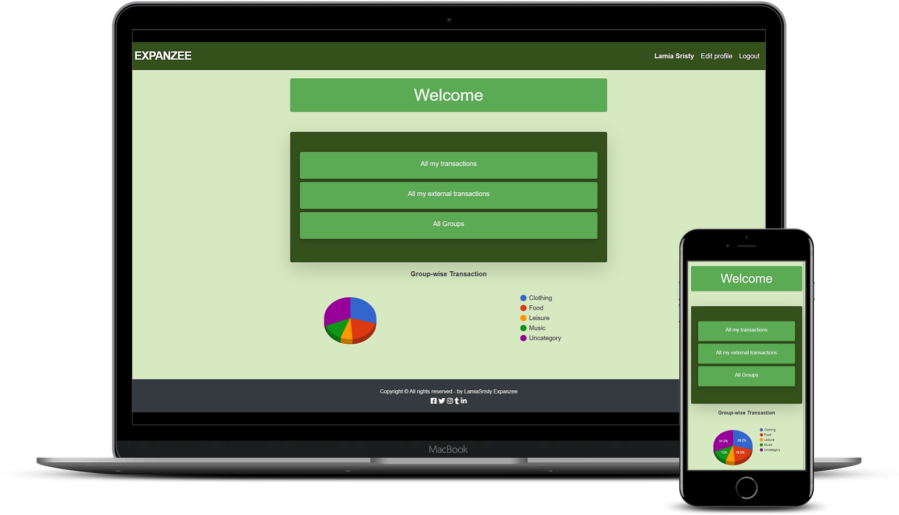
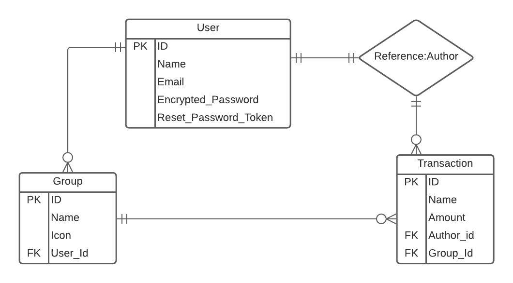

# Group Our Transaction

This project is an application for calculating expenses. Users can create, edit and delete transactions and group them. 

## Application Description:

After log in an user can see:

1. "All my transactions".
2. "All my external transactions".
3. "All groups".
4. A pie chart showing the group wise transactions.

When user opens "All my transactions" and "All my external transactions" page:

1. Total amount is displayed at the top.
2. A list of all transactions created by logged-in user is displayed (sorted by most recent).
3. Each transaction displays its name, amount and date, and an icon of the group; if it has been assigned to.
4. An action button "Add new" is displayed.
5. Each transaction is clickable and opens "Transactions Details" page, where user can edit or delete the transaction.

When user opens "All groups" page:

1. A list of all groups is displayed (example: "Clothing", "Food", "Music") in alphabetical order.
2. Each group displays its icon and name.
3. Each group is clickable and opens "Group transactions" page, where user can edit the group.
4. An action button "Create new" is displayed.
5. The design of the page is similar to the "User profile page"

## Live Demo:
[On Heroku](https://expanzee.herokuapp.com/)

## Screen-shots:


## ERD:


## Video explanation Link:
[watch loom video](https://www.loom.com/share/2d26da7bcc25458eb7487063b222a374).

## Build-With

- Ruby -v 2.7.1
- Rails -v 6.0.3.4
- SQLite3 -v 1.4
- VScode

## Getting Started

### Prerequisites

To get this project up and running locally, you must already have ruby and necessary gems installed on your computer

**To get this project set up on your local machine, follow these simple steps:**

1. Open Terminal.
2. Navigate to your desired location to download the contents of this repository.
3. Copy and paste the following code into the Terminal: git clone https://github.com/LamiaSristy/transactions_app
4. Run ```cd transactions_app```.
5. Run ```bundle install``` to get the necesary gems.
6. Run ```yarn install --check-files``` .
7. Run `rails db:drop`.
7. Run `rails db:create`.
7. Run `rails db:migrate`.

**To check the Rspec Testcases on your local machine, follow these simple steps:**
1. Run ```bundle exec rspec ```

## Author Details::

👤 **Lamia Sristy**

- Github: [@LamiaSristy](https://github.com/LamiaSristy)
- Linkedin: [@LamiaSristy](https://www.linkedin.com/in/lamia-hemayet-sristy/)
- E-mail: <a href="mailto:lamiasristy@gmail.com?subject=Hello Lamia!">Email</a>  
- Twitter: [@LamiaSristy](https://twitter.com/lsristy1)

## Acknowledgment::

Design idea by Gregoire Vella on Behance


## Show your support

Give a ⭐ Star in this repo on GitHub — it helps!

## 📝 License

This project is [MIT](lic.url) licensed.   
