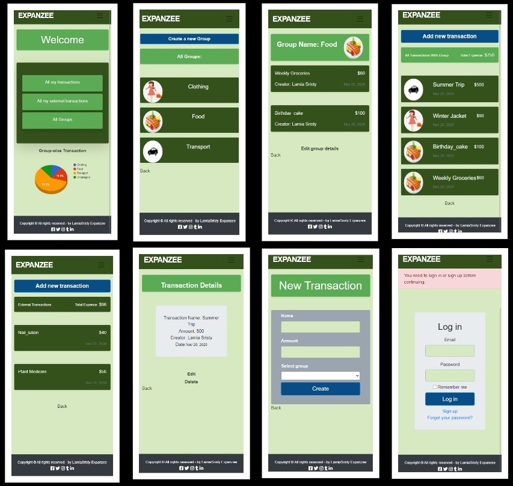

# Group Our Transaction

This project is an application for calculating expenses. Users can create, edit and delete transactions and group them. 
There are 3 models in this project.
1. User
2. Group
3. Transaction

## Live Demo:
[On Heroku](https://whispering-sea-85863.herokuapp.com/users/sign_in)

## Screen-shots:


## ERD:


## Video explanation Link:
[watch loom video](https://www.loom.com/share/00d38320df6a4add9596ee2e93b3ef74).

## Build-With

- Ruby v- '2.7.1'
- Rails v- '6.0.3.4'
- SQLite3 v- '1.4'
- VScode

## Getting Started

### Prerequisites

To get this project up and running locally, you must already have ruby and necessary gems installed on your computer

**To get this project set up on your local machine, follow these simple steps:**

1. Open Terminal.
2. Navigate to your desired location to download the contents of this repository.
3. Copy and paste the following code into the Terminal: git clone https://github.com/LamiaSristy/transactions_app
4. Run ```cd transactions_app```.
5. Run ```bundle install``` to get the necesary gems.
6. Run ```yarn``` .
7. Run `rails db:migrate`.

**To check the Rspec Testcases on your local machine, follow these simple steps:**
1. Run ```bundle exec rspec ```

## Author Details::

👤 **Lamia Sristy**

- Github: [@LamiaSristy](https://github.com/LamiaSristy)
- Linkedin: [@LamiaSristy](https://www.linkedin.com/in/lamia-hemayet-sristy/)
- E-mail: <a href="mailto:lamiasristy@gmail.com?subject=Hello Lamia!">Email</a>  
- Twitter: [@LamiaSristy](https://twitter.com/lsristy1)


## Show your support

Give a ⭐ Star in this repo on GitHub — it helps!

## 📝 License

This project is [MIT](lic.url) licensed.   
